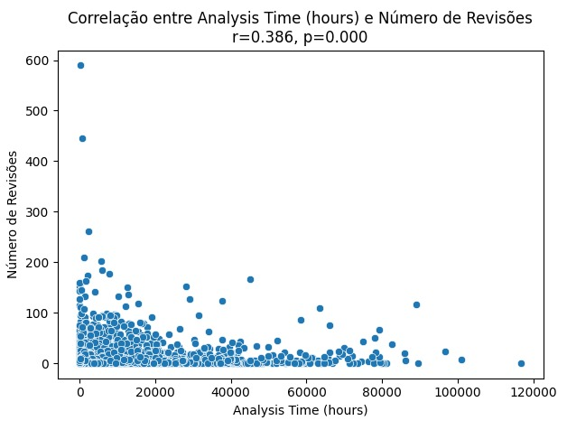

# Relatório final
## Introdução
Este trabalho explora o feedback de PR's de projetos open-source hospedados no GitHub, com foco nos repositórios mais populares. Foi considerado para análise duzentos repositórios com cem ou mais PR's fechados. Foi coletado dados que buscam mostrar o tamanho, tempo de análise, descrição e interações nos PR's, para responder 4 questões envolvendo a quantidade de feedbacks, e nível de aprovação desses feedbacks.

## Hipóteses
### RQ 01. Qual a relação entre o tamanho dos PRs e o feedback final das revisões?
 - PR's maiores tendem a ter mais feedbacks negativos, ou não serem revisados, já que quanto maior o PR maior a complexidade.

### RQ 02. Qual a relação entre o tempo de análise dos PRs e o feedback final das revisões?
 - PR's que ficaram em análise por mais tempo terão feedbacks piores.

### RQ 03. Qual a relação entre a descrição dos PRs e o feedback final das revisões?
 - PR's com descrições maiores terão feedbacks mais positivos do que negativos, isso pois imaginamos que quanto maior a descrição, mais detalhado e consequentemente mais o desenvolvedor que fez o Código sabera o que fez.

### RQ 04. Qual a relação entre as interações nos PRs e o feedback final das revisões?
 - PR's com mais interações, terão feedbacks melhores.

### RQ 05. Qual a relação entre o tamanho dos PRs e o número de revisões realizadas?
 - PR's maiores tem menos revisões.

### RQ 06. Qual a relação entre o tempo de análise dos PRs e o número de revisões realizadas?
 - PR's com mais revisões tendem a ter revisões mais rápidas.

### RQ 07. Qual a relação entre a descrição dos PRs e o número de revisões realizadas?
 - PR's com descrições maiores terão menos feedbacks, isso pois imaginamos que quanto maior a descrição, mais detalhado e consequentemente mais o desenvolvedor que fez o Código sabera o que fez.

### RQ 08. Qual a relação entre as interações nos PRs e o número de revisões realizadas?
 - PR's com mais interações tem menos feedbacks.

## Metodologia
Para responder às questões de pesquisa, foi realizada a coleta de dados dos 200 repositórios mais estrelados no GitHub com 100 ou mais PR's fechados ou mergeados, utilizando para isso as APIs GraphQL da plataforma. Após a coleta, aplicamos a ferramenta CK para realizar a análise estática do código e extrair métricas relacionadas à qualidade interna dos projetos. Os scripts usados foram desenvolvidos em Python, foi priorizado o uso de tal tecnologia pela velocidade de mineração e análise de dados, o uso do node foi desconsiderado por experiências problemáticas em outras pesquisas.

## Resultados obtidos
### a. Feedback das Revisões
#### RQ 01

Pull requests menores tendem a sofrer merge com mais frequência, enquanto PRs maiores tendem a serem fechados, o que pode representar algum desvio no direcionamento da solução.

#### RQ 02

PRs que possuem um maior tempo de análise, tendem a serem fechados e não sofrer merge, o que pode representar que PRs mais complexos tendem a fugir de uma solução simples e ótima.

#### RQ 03

PRs com uma descrição maior tendem a serem aprovados com maior frequência, o que demonstra uma clareza e melhor entendimento do problema por parte do desenvolvedor.

#### RQ 04

Quanto mais comentários um PR possui, maior a chance de ele estar closed e não merged, demonstrando uma divergência na solução apresentada em relação a visão dos revisadores.

### b. Número de Revisões
#### RQ 05

Quanto menor o tamanho do PR, mais revisões serão feitas, tornando-o menos complexo e mais fácil de avaliar.

#### RQ 06

PRs mais simples de avaliar, possuem mais revisões. Logo, quanto mais tempo de avaliação é necessário para um PR, menos quantidade de revisões ele terá.

#### RQ 07

Os PRs que possuem descrições muito longas, tendem a ter menor número de revisões.

#### RQ 08

As interações dos PRs são diretamente proporcionais ao número de revisões.

## Conclusão 
Observamos que PRs menores, com descrições mais detalhadas e menor tempo de análise, tendem a resultar em merges com mais frequência. PRs mais simples e objetivos, com uma boa comunicação entre os envolvidos, geram melhores resultados e melhores entregas por estarem mais alinhados com a solução
Esses resultados destacam a importância de boas práticas na abertura de PRs: manter mudanças pequenas, fornecer descrições claras e objetivas, e buscar a simplicidade para favorecer tanto a revisão quanto a aprovação.
